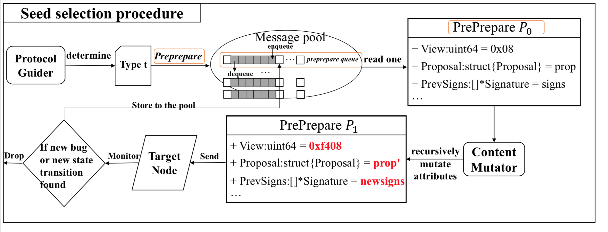

# The procedure of seed selection 

All messages in the seed pool are categorized by their message types. As shown in the below figure, there are a serial of seeds queues divided by message types in the message pool.

(1) Once the Message Guider determines which type to use in the next iteration, for example, a “preprepare” message, then the seed selector will dequeue the “preprepare” p_0 message queue for further mutation process.

(2) More specifically, for numeric types, a numerical mutator will randomly convert it to another number （from 0x08 to 0xf408）. For the string type, a string mutator will modify it by flipping its bytes. For the structure types (from prop to prop'), it will be mutated recursively until numeric types or string types are found.

(3) Then a new “preprepare” message p_1 is generated. LOKI will send it to the target node and monitoring the exeuction information of it.

(4) If there are any new bugs or new state/state transitions found in the target node, the new “preprepare” message will be regarded as interesting and saved to the seed pool for the next iteration.

